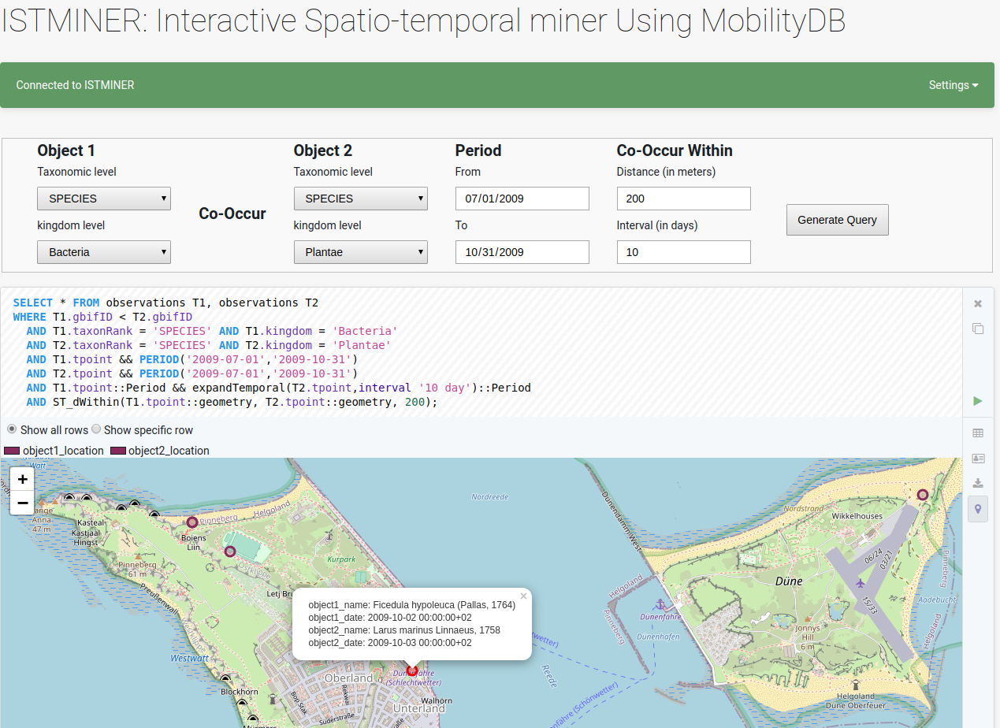

# ISTMINER
This repository is used to summarize and report the methodology and results of ISTMINER: Interactive Spatiotemporal Co-occurrence
Pattern Extraction. This work has been submitted and accepted for publication at Computer Science for Biodiversity (CS4BioDiversity) (https://www.nfdi4biodiversity.org/cs4biodiversity/) workshop at INFORMATIK2021 (https://informatik2021.gi.de)

In recent years, the exponential growth of spatiotemporal data has led to an increasing need for new interactive methods for accessing and analyzing this data. In the biodiversity domain, species co-occurrence models are critical to gain a mechanistic understanding of the processes underlying biodiversity and supporting its maintenance. This paper introduces a new framework that allows users to explore species occurrences datasets at different spatial and temporal periods to extract co-occurrence patterns. As a real-world case study, we conducted several experiments on a subset of the Global Biodiversity Information Facility (GBIF) occurrences dataset to extract species co-occurrence patterns interactively. For better understanding, these co-occurrence patterns are visualized in a map view and as a graph. Also, the user can export these patterns in CSV format for further use. For many queries, runtimes are in a range that allows for interaction already. Further optimizations are on our research agenda.

## Main architecture 

 ISTMINER is a three-tier architecture for spatiotemporal co-occurrence  patterns extraction:
 1.  Stoarge and indexing layer
    * responsible for performing data preprocessing steps as preparation for data indexing
    * data cleaning:
    * feature selection
    * Spatiotemporal types selection
    * Indexing
2.  Core layer 
    * responsible for candidate generation and filtering to extract the spatiotemporal co-occurrence patterns 
    * semantic enrichments    
3.  interactive features layer
    * containing the features provided by the ISTMINER tool
     

## Tools

## Acknowledgments
* This work has been partially funded by the Deutsche Forschungsgemeinschaft (DFG) as part of the CRC 1076 [AquaDiva](http://www.aquadiva.uni-jena.de/) 

## Citation
Please cite the following paper if you used any part of this work.

`@article{istminer,
      author={Dina Sharafeldeen, Mohamed Bakli and Alsayed Algergawy and Birgitta K{\"o}nig-Ries},
      title={ISTMINER: Interactive Spatiotemporal Co-occurrence Pattern Extraction: A Biodiversity case study},
      booktitle={CS4Biodiversity, INFORMATIK2021 },
      year={2021}      
    }`
